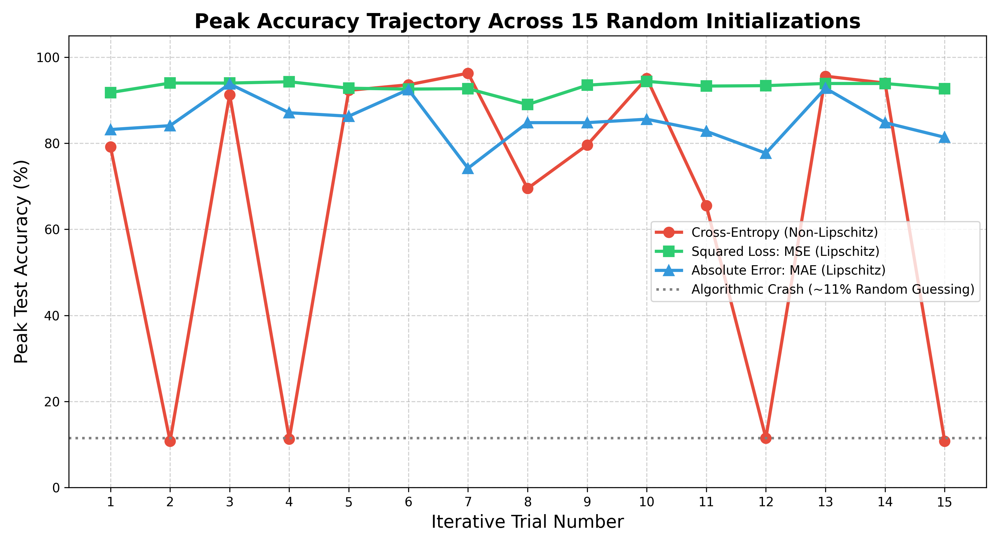

# An Analysis of Lipschitz Continuity for Loss Functions in Neural Networks

**Abstract:** The fundamental goal of machine learning is generalization or performing well on unseen data. Hardt, Recht, and Singer (2016)[1] analytically proved that Stochastic Gradient Descent (SGD) achieves stability, and thus bounds generalization error, strictly when the loss function is Lipschitz continuous. In this project, we mathematically prove the Lipschitz constants for standard loss functions and test them against non-Lipschitz functions. Our results show that the math does hold up: loss functions with strict Lipschitz caps ultimately improve how well the model learns.

---

## The Experiments
To understand if continuous Lipschitz bounds actually physically shield neural networks from chaotic gradient explosions, we built an empirical stress-test ecosystem natively in PyTorch:
* **The Architecture:** We constructed a foundational LeNet Convolutional Neural Network (2 Convolutional layers, 1 Fully Connected layer). It was trained over a 5,000-image subset of the MNIST dataset, mapped to an out-of-sample test array of 1,000 unseen images.
* **The Synchronization (The Stress Test):** Because we were explicitly testing the functional limits of the loss algebra itself, we applied a deliberately aggressive learning rate ($\alpha = 0.5$) uniformly natively across all optimization algorithms. 
* **The 15-Run Metric:** To prove the bounds natively guaranteed algorithmic safety and were not just a statistical byproduct of "lucky" weight matrices, we autonomously executed the training sequence 15 separate times, completely randomizing the origin matrices before every run.

---

## Results
Validating theory, the models restricted by formal Lipschitz boundaries outperformed the un-bounded Cross-Entropy model when forced to navigate chaotic starting conditions. The average final accuracy of the 15 trials are shown in the table below. 

| Loss Function | Mathematical Property | Average Peak Accuracy (15 Trials) |
| :--- | :--- | :--- |
| **Squared Loss (MSE)** | Lipschitz Bounded | **90.6%** |
| **Mean Absolute Error (MAE)** | Lipschitz Bounded | **84.8%** |
| **Cross-Entropy** | Un-Bounded / Non-Lipschitz | **62.9%** |

To visually capture the structural resilience of these optimization bounds, we charted the peak test accuracy of all three functions side-by-side across the 15 trials. The resulting graph below explicitly displays the exact moments that the unbounded function experiences catastrophic gradient failure, contrasting those violent drop-offs perfectly against the horizontal stability of the Lipschitz functions.

Because the non-Lipschitz Cross-Entropy function lacked a formal mathematical ceiling, it was structurally vulnerable. Its un-capped gradients frequently forced the algorithm to take massive steps. In 4 out of the 15 trials, it crashed completely to ~11% (equivalent to random guessing on 10 MNIST classes), dragging its 15-trial statistical average to a  62.9%. In stark contrast, the Lipschitz limits organically safeguarded Mean Squared Error (MSE) and Mean Absolute Error (MAE) regardless of mathematically chaotic starting coordinates.

---

## Repository Scripts
* `paper_replication/mnist_generalization.py`: Single-run model execution explicitly tracking test vs train accuracy trajectories.
* `paper_replication/mnist_average_generalization.py`: The 15-iteration loop dynamically randomizing torch matrix seeds to calculate the formal statistical generalization averages.

## References
[1] Hardt, M., Recht, B., & Singer, Y. (2016). Train faster, generalize better: Stability of stochastic gradient descent. In *International Conference on Machine Learning* (pp. 1225-1234). PMLR.
